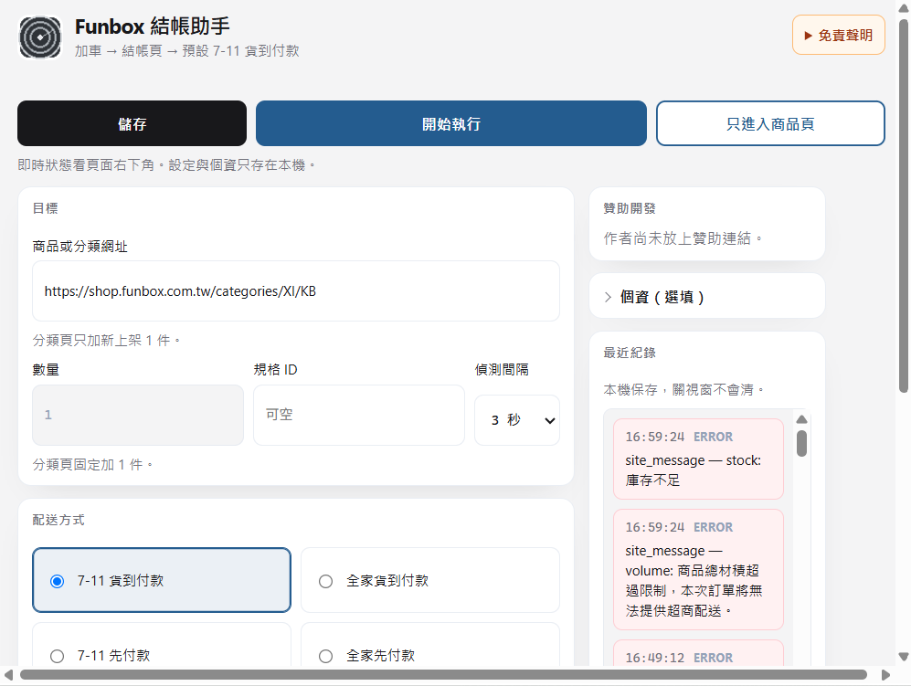
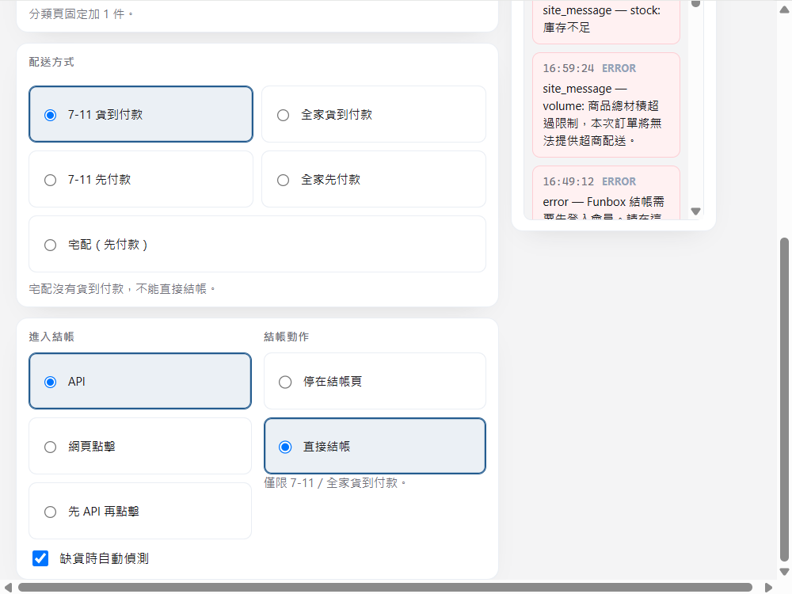

# Funbox 結帳助手

Chrome 擴充功能：在 [Funbox 官網](https://shop.funbox.com.tw/) 偵測商品、加入購物車、打開**真正的結帳頁**（`/carts/{token}`）並選配送／取貨方式。

直接開 `/checkout` 常會看到「結帳功能已關閉」。做成擴充功能是因為 Funbox（Cyberbiz）購物車與結帳綁在瀏覽器登入 session。

**必須先登入 Funbox 會員**，否則無法加車、看購物車或進入 `/carts/{token}`。

## 免責聲明

本工具為**非官方**開源專案，與 Funbox、麗嬰國際、CYBERBIZ、7-ELEVEN、全家 FamilyMart 無關，亦非其授權、代理或合作產品。

你在此外掛填寫的個資、設定與操作紀錄，僅保存在你這台電腦的 Chrome 本機儲存（`chrome.storage.local`），外掛作者沒有伺服器，**不會上傳、蒐集或轉售你的資料**。卸載此外掛即可清除本機資料。若結帳頁需要補填，資料才可能寫入 Funbox 官網表單；送出訂單後由 Funbox 依其隱私權政策處理。

本外掛**不串接信用卡、ATM、LINE Pay 或其他金流**，不代收付款，也不處理購物金流。自動送出僅限你主動選擇的超商貨到付款。

禁止利用本工具對網站進行攻擊、癱瘓、繞過驗證、過高頻率刷新、大量爬取、囤積、黃牛或**二次轉賣**等惡意或違法行為。請遵守 Funbox 網站條款與相關法令。

使用、購買、未買到、重複下單、帳號停權、爭議、損失及任何法律責任，均由使用者自行承擔。本工具不提供保證。贊助與 Funbox 結帳無關。

## 安裝（不必上架 Chrome 線上應用程式商店）

開源使用**不需要**先發布到 Chrome 線上應用程式商店。支援的安裝方式是從本 repo **載入未封裝項目**：

1. 用 git clone 或下載這個資料夾 `funbox-checkout-helper`
2. 打開 Chrome，網址列輸入 `chrome://extensions`
3. 開啟右上角「開發人員模式」
4. 按「載入未封裝項目」，選這個資料夾 `funbox-checkout-helper`（裡面要看得到 `manifest.json`）
5. 在同一個 Chrome 先登入 [Funbox 會員](https://shop.funbox.com.tw/)

之後改過程式碼，到 `chrome://extensions` 按重新載入即可。

商店上架是可選的後續發行管道，方便不熟開發人員模式的人安裝。結帳自動化類擴充功能常會碰到商店政策審查，**本專案以未封裝載入為正式支援路徑**，不依賴、也不要求上架。

## 介面

載入後點工具列圖示會出現設定視窗（約 760×640）。即時監看倒數在 Funbox 頁面右下角，不在這個視窗裡。

- **儲存 / 開始執行 / 只進入商品頁**：設定只存在本機；開始執行才加車或監看；只進入商品頁只開網址、不加車。
- **目標**：商品頁或分類頁網址。分類頁數量固定 1，且只加新上架／補貨。
- **配送與結帳**：預設 7-11 貨到付款。直接結帳僅限超商貨到付款。
- **最近紀錄**：本機保存的步驟；錯誤列為紅底。

## 使用

1. **登入**：在已載入此外掛的 Chrome 登入 Funbox。未登入時加車 API 可能看似成功，但 `/cart` 會出現「繼續操作前請註冊或者登錄」。
2. **填網址**（彈出視窗）：
   - **主要：商品頁** `https://shop.funbox.com.tw/products/{handle}`。用來補貨已知 SKU。數量只對這一件生效，預設 1。會依規格 `inventory_quantity` 與商品頁可見的限購／max／`data-quantity` 自動調降；若你填的數量超過上限，會改成允許的件數，overlay／紀錄顯示「受庫存或購買限制調整為 N」。
   - **可選：分類／系列頁** `/categories/...` 或 `/collections/...`。只偵測**新上架**：出現一件新的有貨商品時，加車 **1** 件（無法為未知 SKU 預先設數量，也不會把分類裡每件都加進去）。overlay 會顯示加入的 handle。之後請改填該商品頁鎖定。
3. **配送方式**（預設 **7-11 貨到付款**）：
   - 7-11 貨到付款、全家貨到付款（可設直接結帳）
   - 7-11／全家取貨（先付款，只選項、不送出）
   - 一般宅配（Funbox 宅配為先付款，**沒有宅配貨到付款**，不能直接結帳）
4. **結帳動作**：
   - **停在結帳頁**（預設）：加車、打開 `/carts/{token}`、選你指定的配送方式（預設 7-11 貨到付款，不會選先付款）。**不按「立即結帳」**。理論上 Funbox 會自動帶入購買人資料；第一次偵測若沒帶入，外掛才用彈出視窗的個資補填，補填後請你自行核對並下單。準備好後會用系統通知、分頁標題「【可結帳】」提醒；點通知可回到結帳分頁。不會寄信：外掛沒有郵件伺服器，且結帳網址綁這個 Chrome 的登入 session，寄到信箱通常打不開。
   - **直接結帳**：彈出視窗僅在選 **7-11 或全家貨到付款** 時可選；宅配／先付款會停用。實際送出還須已有門市、且官網已自動帶入個資。若官網沒帶入而外掛補填了個資，或直接結帳失敗，會停在結帳頁交給你處理。無已儲存門市時**不會隨機選店**。

**工具列彈出視窗 vs 頁面右下角按鈕**：設定只在工具列彈出視窗。「只進入商品頁」只開網址、不加車。右下角：商品頁「加車並開結帳」、結帳頁「只選配送方式」、監看中「停止監看」。
5. **自動偵測間隔**：3／5／10／15／30 秒（建議 10 秒以上）。補貨／新上架用 **API 偵測**；為避免登入過期，監看中 **每 1 分鐘重整一次頁面**。進行中以右下角倒數為準，並可按「停止監看」。你自己刷新分頁則監看會停。
   - 商品頁缺貨：有貨後加車，**補貨數量固定 1**。
   - 分類頁：只在**新 handle 出現且有貨**時加車 1 件。
6. 打開 `/carts/{token}` 後會核對明細：商品、SKU、數量。不符則停止、不送出。
7. 僅當官網出現「商品總材積超過限制，本次訂單將無法提供超商配送。」（或同等完整句）時，才會 overlay「官網：超商材積超限」。數量大於 1、PackAge+「材積」說明、或缺超商選項**不會**自行判定為體積限制。若「7-11 貨到付款」無法選取且沒有該原文，overlay 為「7-11 貨到付款無法選取」。超商因材積無法結帳時**不會**自動改送宅配，也不會重試加車。
8. 測試請用非陀螺現貨 `https://shop.funbox.com.tw/products/ru2512`

流程（可對照）：
- **API（預設）**：`POST /cart/add.js` → 解析 `/carts/{token}` → 直接開啟結帳頁 → 選配送。
- **網頁點擊**：加車後開 `/cart`，再點購物車上的「立即結帳」進入 `/carts/{token}`。

彈出視窗會顯示步驟紀錄（存在你這台電腦的 Chrome `chrome.storage.local`），不會記錄密碼或信用卡資料。個資與設定同樣只在本機；外掛沒有自己的後端可上傳。若結帳頁需要補填，才會寫入 Funbox 官網表單。

## 贊助

彈出視窗有「贊助開發」區塊。連結由作者寫在 `src/popup.js` 的 `DONATE`，使用者不用自行填。尚未放上連結時會顯示「作者尚未放上贊助連結。」贊助不是使用條件，也與 Funbox 購物金流無關。

## 不會做的事

- 停在結帳頁時不自動下單；官網已帶入個資則不覆寫，沒帶入才補填並交給你核對
- 自動送出僅限 7-11／全家超商貨到付款，且須官網已帶入個資；失敗則交給你處理結帳頁
- 不串金流、不填信用卡、不處理贊助金流
- 不繞過登入、驗證碼或網站保護
- 不幫你亂選超商門市
- 不把分類頁裡每一件商品都加進購物車

## 為什麼可能停在登入頁或「結帳已關閉」

未登入時 `/cart` 會出現「繼續操作前請註冊或者登錄」。空的 `/checkout` 會顯示「網站結帳功能已關閉」。請先登入，並從購物車進入 `/carts/{token}`。部分大型商品會因材積限制無法超商配送，結帳頁可能只剩「一般宅配」。
